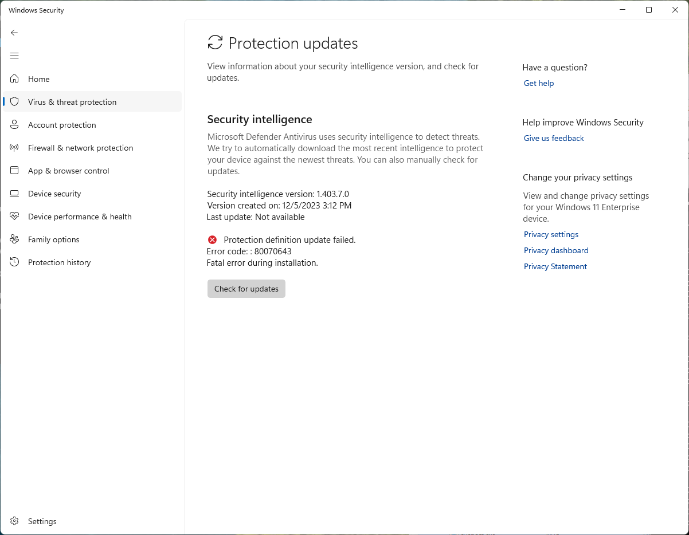
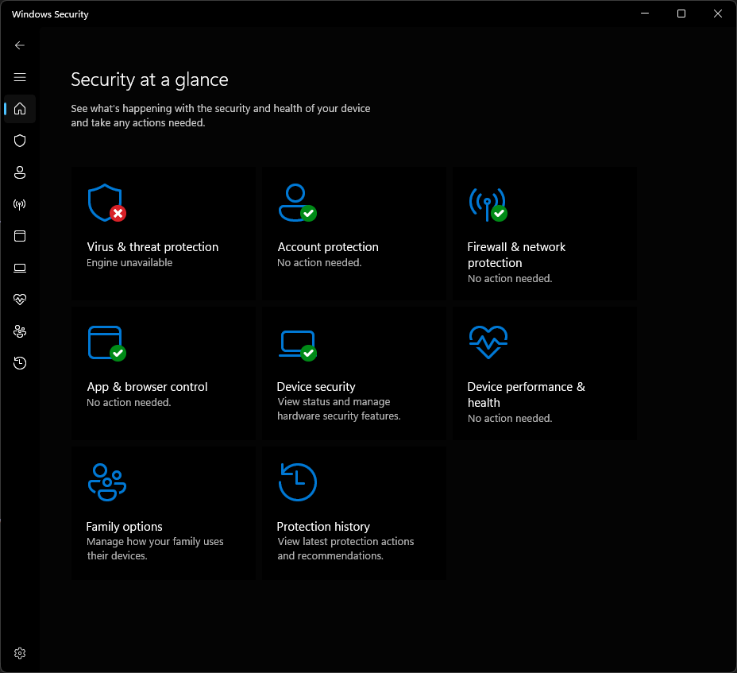

# UnDefend
Repository hosting windows defender DOS tool

This tool does not need administrative privileges and can works as a standard user.

It runs in two modes, passive and aggressive,

In Passive mode, the PoC blocks all signature updates, causing defender to be unable to detect any new threats so if anything new is pushed by Microsoft, it is immediately blocked.

In Aggressive mode, the PoC aims to completely disable but it only works if Microsoft pushes a major platform update (update of MsMpEng.exe and other binaries), this update isn't pushed occasionally like signature updates so the PoC runs in passive mode by default. However, if you expect a major platform update, set the PoC to run in aggressive mode and it will cause windows defender to stop responding. It will be completely disabled and you can run whatever you want without having defender interfer in your business.

Now funnily enough, I found a way to lie to the EDR web console to show that defender is up and running with the latest update even if it's not. I was thinking about publishing the code but after thinking about it, it will cause waaay too much damage so I think I'll keep that stuff stashed for now. 
